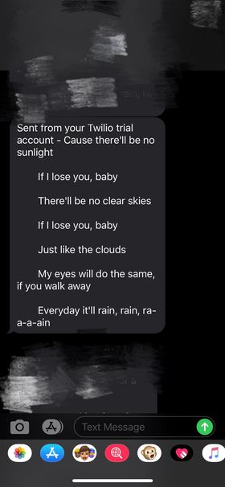

# Wake Up with Beautiful Lyrics
A few lines of beautiful lyrics will show up on your phone when you wake up! 
Let's start our day with a good mood!

<!--ts-->
   * [Wake Up with Beautiful Lyrics](#wake-up-with-beautiful-lyrics)
      * [Introduction](#introduction)
      * [Setup](#setup)
      * [How to Use?](#how-to-use)

<!-- Added by: shiqi, at: Sun Dec  6 21:57:33 EST 2020 -->

<!--te-->

## Introduction
This Python program sends you lines of beautiful lyrics every morning at 7:00 with your phone number provided. 
You can also offer the phone number of your loved one/friend/family member. 

## Setup
* Python
* [schedule](https://pypi.org/project/schedule/) library
* [Twilio](https://www.twilio.com/) account

## How to Use?
1. Install schedule library.
```
pip install schedule
```
2. Create an account at Twilio.
Twilio offers communication APIs for SMS, voice, video. 
You can have one free Twilio number. 
Get it [here](https://www.twilio.com/try-twilio).

3. Put user info in `twilio_credential.py`.
* Input your Twilio account info in the first section. 
* Input your cell phone number in the second section. 

4. Run the code and wait for your message.
```
python main.py
```
<p align="center">
  
</p>
